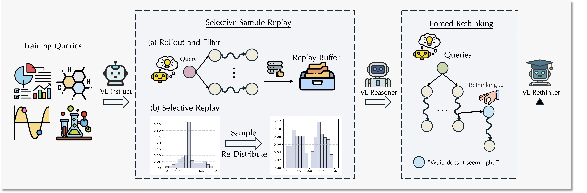

# VL-Rethinker: Incentivizing Self-Reflection of Vision-Language Models with Reinforcement Learning

<a target="_blank" href="https://arxiv.org/abs/2504.08837">
</a>
<a target="_blank" href="#">
</a>
<a target="_blank" href="https://tiger-ai-lab.github.io/VL-Rethinker/">
</a>
<!-- <a target="_blank" href="">
</a> -->
<a target="_blank" href="https://huggingface.co/TIGER-Lab/VL-Rethinker-7B">
</a>
<!-- <a target="_blank" href="https://twitter.com/DongfuJiang/status/1805438506137010326">
</a> -->
<br>


<span style="color:#183385; font-size: 14pt; font-family: Roboto, Helvetica, Arial, Heveltica Neue, sans-serif">
     <b>Authors:</b>
     <a class="name" target="_blank" href="https://HaozheH3.github.io">Haozhe Wang</a>, 
     <a class="name" target="_blank" href="">Wei Chu</a>, 
     <a class="name" target="_blank" href="#">Fangzhen Lin</a>,
     <a class="name" target="_blank" href="https://wenhuchen.github.io/">Wenhu Chen</a>&nbsp; 

<!-- ## 🔥News

- [2025/2/3] We release the [Paper](), and the [🤗 Models]() on Hugging Face.  -->


## Overview


<details><summary>Abstract</summary> 
Recently, slow-thinking systems like GPT-o1 and DeepSeek-R1 have demonstrated great potential in solving challenging problems through explicit reflection. They significantly outperform the best fast-thinking models, such as GPT-4o, on various math and science benchmarks. However, their multimodal reasoning capabilities remain on par with fast-thinking models. For instance, GPT-o1's performance on benchmarks like MathVista, MathVerse, and MathVision is similar to fast-thinking models. In this paper, we aim to enhance the slow-thinking capabilities of vision-language models using reinforcement learning (without relying on distillation) to advance the state of the art. First, we adapt the GRPO algorithm with a novel technique called Selective Sample Replay (SSR) to address the vanishing advantages problem. While this approach yields strong performance, the resulting RL-trained models exhibit limited self-reflection or self-verification. 
To further encourage slow-thinking, we introduce Forced Rethinking, which appends a textual rethinking trigger to the end of initial rollouts in RL training, explicitly enforcing a self-reflection reasoning step. By combining these two techniques, our model, \model, advances state-of-the-art scores on MathVista, MathVerse, and MathVision to achieve significantly to achieve 80.3\%, 61.8\% and 43.9\% respectively. \model also achieves open-source SoTA on multi-disciplinary benchmarks such as MMMU-Pro, EMMA, and MEGA-Bench, narrowing the gap with GPT-o1. Our empirical results show the effectiveness of our approaches.

</details>

## Release Progress
- [x] models.
- [ ] inference and evaluation code.
- [ ] training code.

### RL-ed Models
- [VL-Rethinker-7B](https://huggingface.co/TIGER-Lab/VL-Rethinker-7B): undergoes the proposed SSR and Forced Rethinking training from Qwen2.5-VL-7B-Instruct.
- [VL-Rethinker-72B](https://huggingface.co/TIGER-Lab/VL-Rethinker-72B): undergoes the proposed SSR and Forced Rethinking training from Qwen2.5-VL-72B-Instruct.

We are training 32B and further enhancing these models. Stay Tuned!


## Performance
See our [website](https://tiger-ai-lab.github.io/VL-Rethinker/) or [paper]() for detailed performance report.


## Inference 
Our models are established on top of the Qwen2.5-VL family. So we include a simple use case here, and refer the readers to [the standard inference procedure of Qwen2.5-VL](https://github.com/QwenLM/Qwen2.5-VL).


```python
from transformers import Qwen2_5_VLForConditionalGeneration, AutoProcessor
from qwen_vl_utils import process_vision_info

# default: Load the model on the available device(s)
model = Qwen2_5_VLForConditionalGeneration.from_pretrained(
    "TIGER-Lab/VL-Rethinker-7B", torch_dtype="auto", device_map="auto"
)

# We recommend enabling flash_attention_2 for better acceleration and memory saving, especially in multi-image and video scenarios.
# model = Qwen2_5_VLForConditionalGeneration.from_pretrained(
#     "Qwen/Qwen2.5-VL-7B-Instruct",
#     torch_dtype=torch.bfloat16,
#     attn_implementation="flash_attention_2",
#     device_map="auto",
# )

# default processor
# processor = AutoProcessor.from_pretrained("TIGER-Lab/VL-Rethinker-7B")


min_pixels = 256*28*28
max_pixels = 1280*28*28
processor = AutoProcessor.from_pretrained("TIGER-Lab/VL-Rethinker-7B", min_pixels=min_pixels, max_pixels=max_pixels)

messages = [
    {
        "role": "user",
        "content": [
            {
                "type": "image",
                "image": "https://qianwen-res.oss-cn-beijing.aliyuncs.com/Qwen-VL/assets/demo.jpeg",
            },
            {"type": "text", "text": "Describe this image."},
        ],
    }
]

# Preparation for inference
text = processor.apply_chat_template(
    messages, tokenize=False, add_generation_prompt=True
)
image_inputs, video_inputs = process_vision_info(messages)
inputs = processor(
    text=[text],
    images=image_inputs,
    videos=video_inputs,
    padding=True,
    return_tensors="pt",
)
inputs = inputs.to(model.device)

# Inference: Generation of the output
generated_ids = model.generate(**inputs, max_new_tokens=128)
generated_ids_trimmed = [
    out_ids[len(in_ids) :] for in_ids, out_ids in zip(inputs.input_ids, generated_ids)
]
output_text = processor.batch_decode(
    generated_ids_trimmed, skip_special_tokens=True, clean_up_tokenization_spaces=False
)
print(output_text)

```

**Important Notes**:

Based on the training configurations of the VL-Rethinker family, it's recommended to:
- *Prompt*: 

    append `\n\nPlease reason step by step, and put your final answer within \\boxed{}` after the use queries.
- *Resolutions*: 
    ```
    min_pixels = 256*28*28
    max_pixels = 1280*28*28
    ```


## 🚀Quick Start
The proposed algorithm is implemented with the [OpenRLHF](https://github.com/OpenRLHF/OpenRLHF) framework.

### Installations
Please see [the installation instructions](installation.md).

### Evaluation
Our models can be evaluated like Qwen2.5-VL using [lmms_eval](https://github.com/EvolvingLMMs-Lab/lmms-eval).

Here we provide an alternative evaluation approach. It offers the following benefits:
- Fast: Batch inference using vLLM for 1K queries on 8 A800 within 30 mins.
- Convenient: Evaluation without time-consuming API calls. Judgement made by our rule-based functions align with LLM Judges.
- Train-Test Aligned: the evaluation re-uses the correctness judgement of training to minimize the gap between training and test-time evaluation.

The evaluation is integrated with the OpenRLHF framework. 
```bash
bash ./scripts/eval_7b.sh [benchmark] [modelname] [modelpath]
```


### Training
Run the following.
```bash
bash ./scripts/train_vlm_7b.sh
```
Hyperparameters:
(TBA)

## Dataset
High-Quality training queries are crucial factors to the success of RL training. We curate a 16K query set based on existing datasets, which
- includes diverse topics: perception, reasoning, scientific topics.
- is meticulously selected and cleaned, leading to a collection of consolidated challenging queries. 

We will release the dataset soon.


## Citation
If you find this work useful, please give us a free cite:
```bibtex
@article{vl-rethinker,
      title={VL-Rethinker: Incentivizing Self-Reflection of Vision-Language Models with Reinforcement Learning},
      author = {Wang, Haozhe and Qu, Chao and Huang, Zuming and Chu, Wei and Lin, Fangzhen and Chen, Wenhu},
      journal={arXiv preprint arXiv:2504.08837},
      year={2025}
}
```
